# Praktikum 5
## Membuat document.write dan console.log

* Fungsi document.write adalah untuk menampilkan data langsung pada halaman web.
* Sedangkan console.log untuk menampilkan teks ke console javascript, contohnya seperti berikut.

* Maka hasil yang ditampilkan di web akan seperti gambar berikut.

## Membuat window.alert
* Fungsi window.alert adalah untuk menampilkan sebuah peringatan.

* Contoh gambar window.alert.

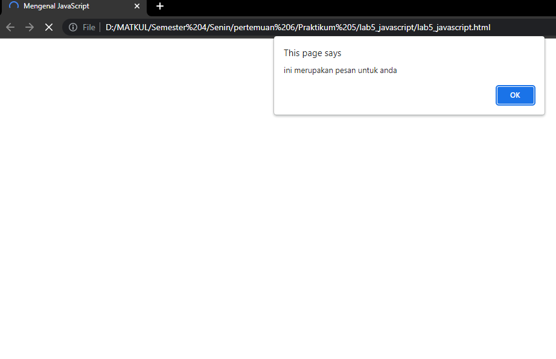

##  Membuat Variabel
* Fungsi prompt() yaitu untuk mengambil inputan dari pengguna.

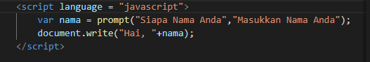

* Maka akan menampilkan gambar seperti berikut.

## Menampilkan informasi atau pesan.

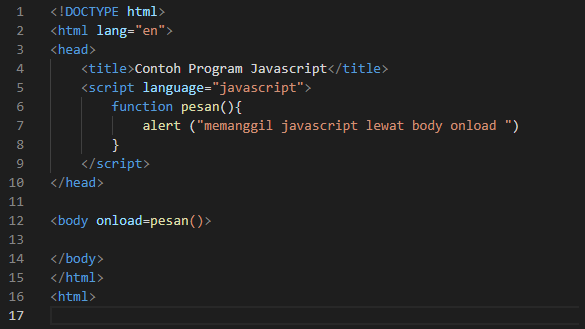

* Contoh Gambar.

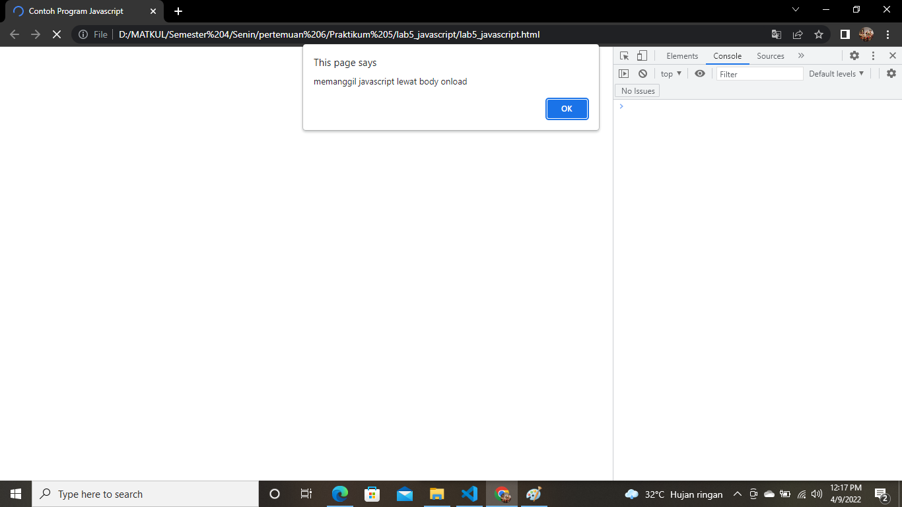

## Membuat Perhitungan Arithmatic.

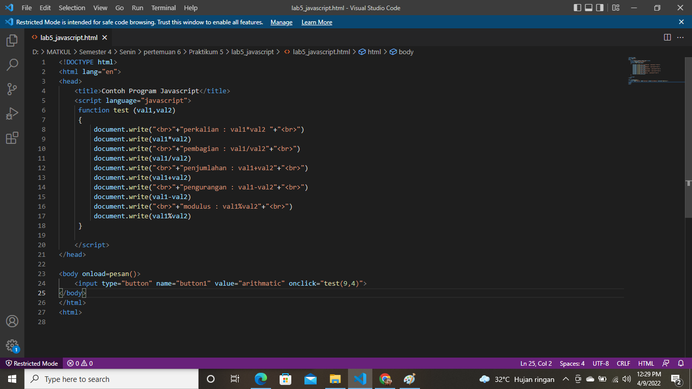

* Hasil nya akan seperti ini.

## Membuat Penilaian.
* Membuat variabel nilai
* Membuat kondisi if dan else
    Bisa dikatakan if jika, nilai lebih besar sama dengan 60 maka akan menampilkan hasil = LULUS. Sedangkan kondisi yang bisa dikataka else jika, nilai ;ebih kecil dari 60 maka akan menampilkan hasil = TIDAK LULUS.

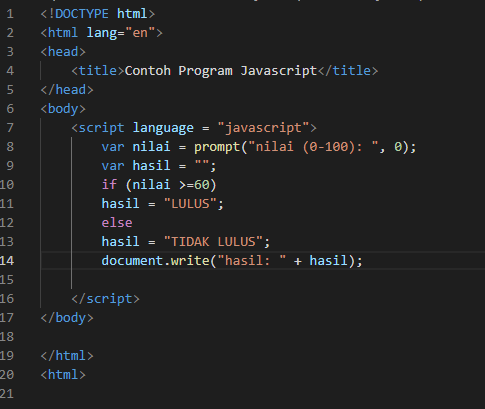

* Contoh hasil dari nilai lebih besar 60 yang dinyatakan LULUS.

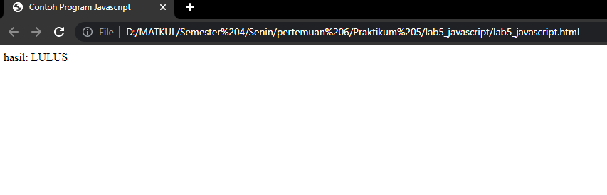

* contoh menambahkan nilai kurang dari 60.

* Maka Hasilnya sepertiberikut.

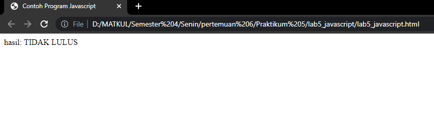

## Membuat Looping Switch
* Penggunaan operator swtich untuk seleksi kondisi.

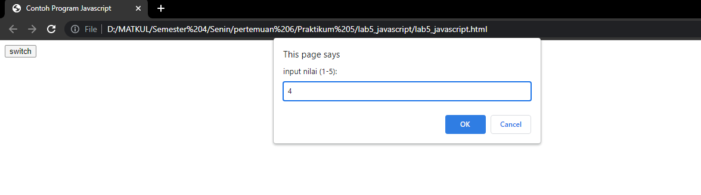

## Membuat Form
* Form imput

* Hasilnya seperti berikut.

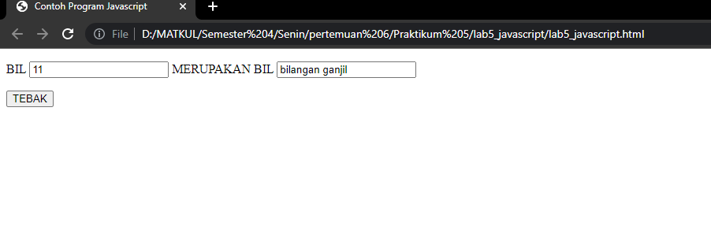

* Form Button

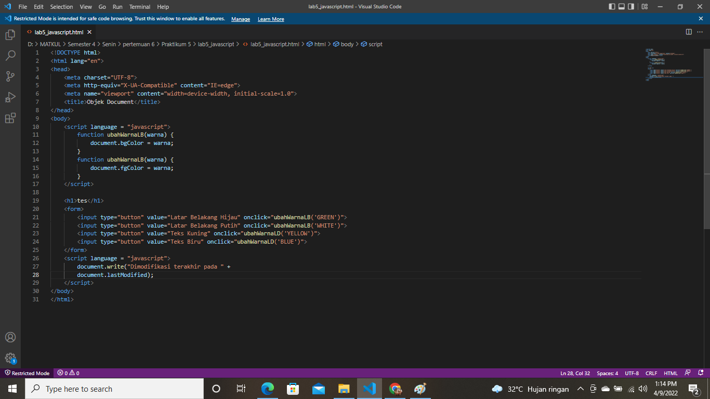

* Maka akan menampilkan gambar seperti berikut.

## HTML DOM
Pilihan menggunakan checkBox dengan perhitungan otomatis.

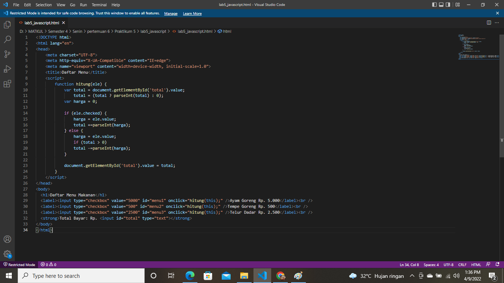

* Maka akan menampilkan gambar seperti berikut.

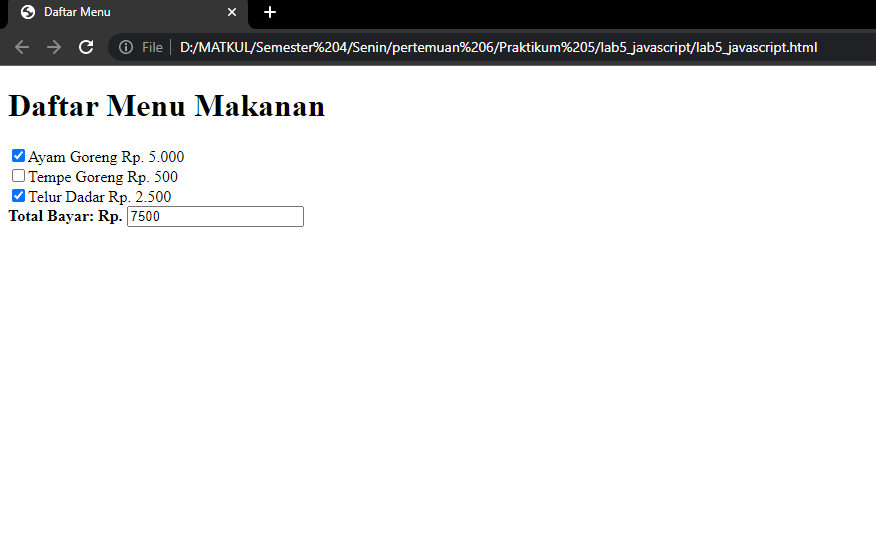
